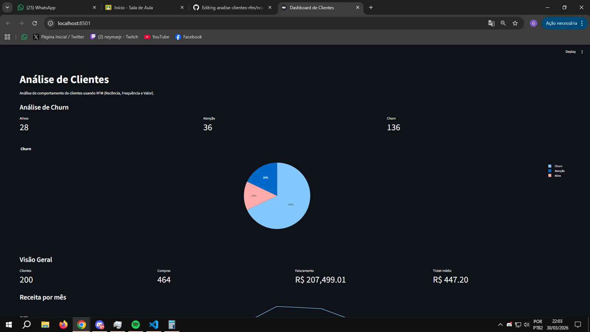
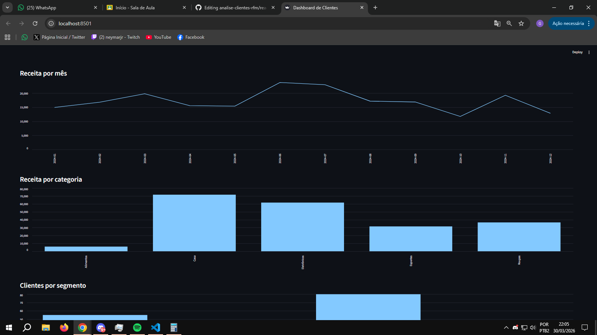
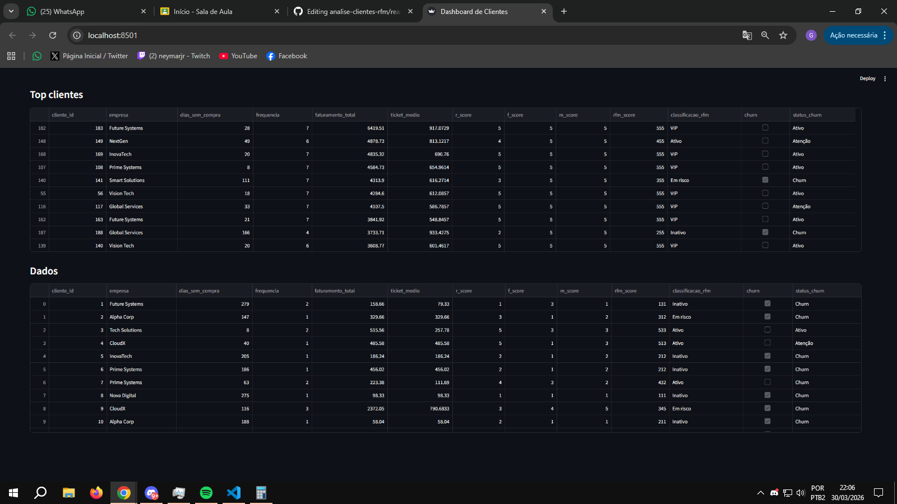

# 📊 Análise de Clientes com RFM

Este projeto tem como objetivo analisar o comportamento de clientes utilizando a técnica RFM (Recência, Frequência e Monetário), permitindo identificar padrões de compra, segmentar clientes e detectar risco de churn.

---

## 🚀 Objetivo

Demonstrar habilidades em análise de dados e geração de insights, simulando um cenário real de negócio e apoiando a tomada de decisão baseada em dados.

---

## 🧠 Funcionalidades

* Geração de base de dados simulada com comportamento realista
* Cálculo das métricas RFM:

  * **Recência**: tempo desde a última compra
  * **Frequência**: quantidade de compras
  * **Monetário**: valor total gasto
* Segmentação de clientes:

  * VIP
  * Ativo
  * Em risco
  * Inativo
* Identificação de clientes com risco de churn
* Dashboard interativo para visualização dos dados

---

## 📊 Principais análises

* Distribuição de clientes por segmento
* Receita ao longo do tempo
* Receita por categoria
* Ranking de clientes por faturamento
* Identificação de padrões de comportamento

---

## 📸 Demonstração do Sistema

### Dashboard principal



### Gráficos de Clientes



### Tabela



---

## 🛠️ Tecnologias utilizadas

* Python
* Pandas
* NumPy
* Streamlit
* Plotly

---

## ▶️ Como executar o projeto

```bash
# Gerar dados
python gerar_base.py

# Calcular RFM
python gerar_rfm.py

# Rodar dashboard
streamlit run dashboard.py
```

---

## 💡 Insights gerados

O projeto permite identificar clientes com maior valor, detectar padrões de comportamento e antecipar possíveis casos de churn, auxiliando na criação de estratégias de retenção.

---

## 📌 Próximos passos

* Deploy do dashboard em ambiente online
* Integração com dados reais
* Melhorias nos modelos de segmentação
